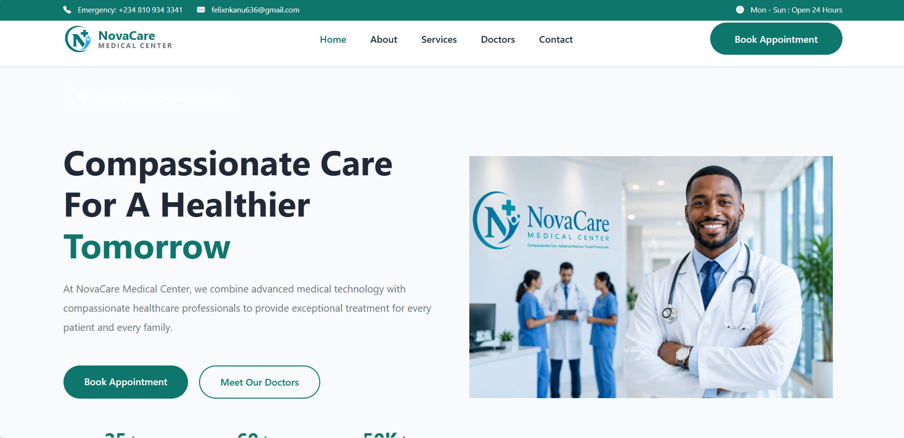
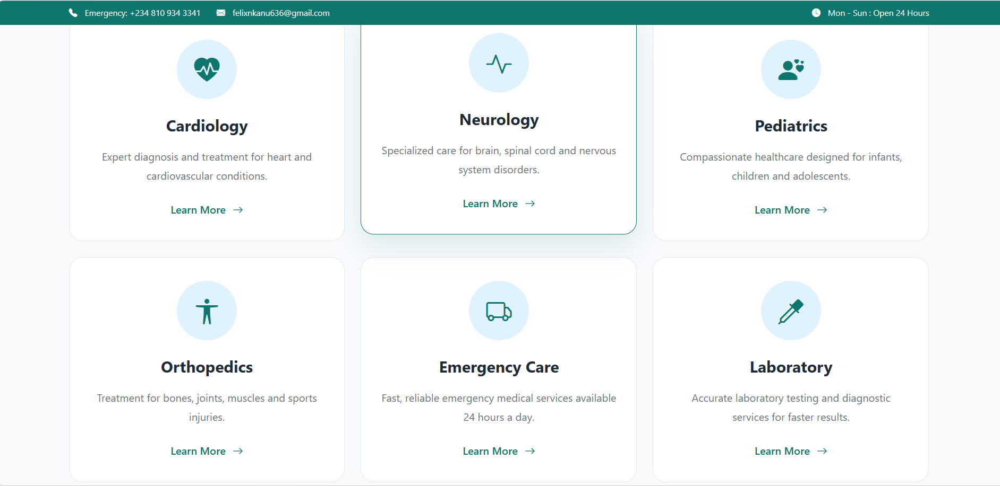
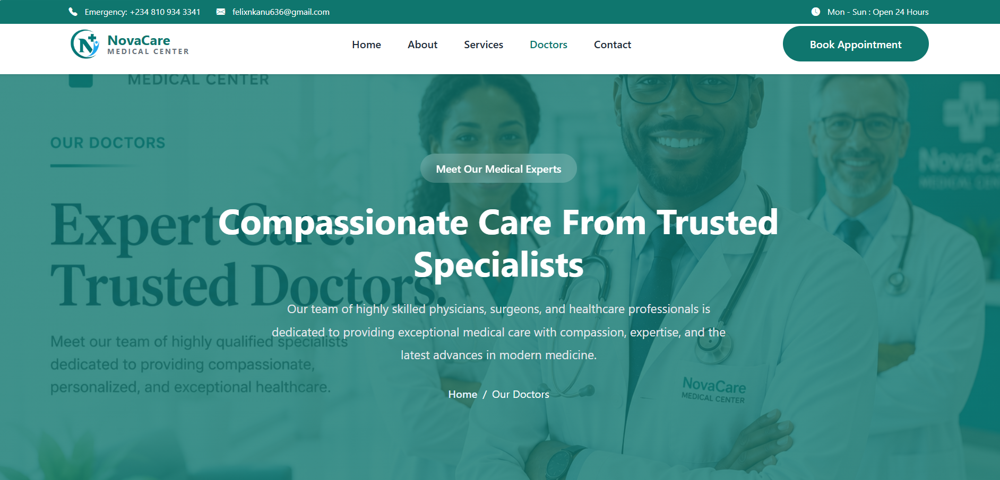

# NovaCare Medical Center | Modern Healthcare Website

A modern, responsive healthcare website designed to provide patients with easy access to medical services, experienced healthcare professionals, and appointment booking through an intuitive and user-friendly interface.

---

## 📖 Overview

NovaCare Medical Center is a frontend healthcare website built using modern web technologies to demonstrate responsive web design, clean user interface development, and professional healthcare branding. The website offers information about medical services, experienced doctors, patient care, and appointment scheduling.

---

## ✨ Features

- Modern healthcare homepage
- Fully responsive design
- Medical services section
- Doctor profiles
- Appointment booking page
- About Us page
- Patient testimonials
- Contact page
- Emergency contact information
- Mobile-friendly layout

---

## 🛠️ Technologies Used

- HTML5
- CSS3
- Bootstrap 5
- JavaScript

---

## 🚀 Live Demo

**Website**

*Add your Vercel URL here.*

---

## 📂 Project Structure

```text
novacare-medical-center/
│
├── css/
├── images/
├── screenshots/
│   ├── homepage.png
│   ├── services.png
│   ├── doctors.png
│   └── mobile-view.jpg
├── index.html
├── about.html
├── services.html
├── doctors.html
├── appointment.html
├── contact.html
└── README.md
```

---

## 📸 Screenshots

### Homepage



---

### Medical Services



---

### Our Doctors



---

### Mobile View


---

## 🚀 Future Improvements

- Online appointment booking system
- Patient login portal
- Electronic medical records integration
- Live chat support
- Online pharmacy
- Telemedicine consultation
- Health blog management
- Backend database integration

---

## 👨‍💻 Author

**Felix Nkanu**

- GitHub: https://github.com/Felix-Nkanu
- Portfolio: https://my-portfolio-website-psi-one.vercel.app/
- Email: felixnkanu636@gmail.com

---

## ⭐ Support

If you found this project helpful, consider giving it a ⭐ on GitHub.